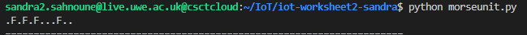

# Introduction:
## Setup - Worksheet 1 :
In order to run the Morse Code project in both parts of worksheet 2, a setup is required:
 - Connect to csct cloud uwe server following the setup guides in BB
 - using suitable Os for Vscode ; in this case Linux 
 - Python interpreter at 3.8 version.
 - websockets , asyncio, Json needed as an extention 

# iot-worksheet2-sandra
# Part 1 :

The worksheet 2 part 1 aims to implement a Morse code using a binary tree and a dictionary including two functions encode(msg : str) and decode(msg : str) both returning a string message.

Decode required the use of a binary tree to convert a string of input into an equivalent morse code string, with each character separated by a space. The tree should be traversed with dots and dashes, and the value of each node should be returned when the input is finished.
Encode had to accomplish the same thing, but in the reverse way: it had to turn a string of decrypted ascii characters into a string of morse code characters.
All of the values needed to encode plaintext and decode morse are stored in a binary tree structure with multiple functions to involve it and may be browsed.
can be found here: [Binary Tree](BinaryTree.py) and created with the intention of manually configuring and connecting each node to the reference of Binary Tree image as follow:


Finally test the implementation by running multiple tests.

## Task 1 : 
this task required to run an actual morse code in a server localhost: 10105 by forwarding the port.
it aims to convert the word "us" into morse "..- ..." and vice-versa 
the following picture shows the implementation of morse code in server 10105


## Task2 : 
--- 
The aim of this task is to implement two functions : 

* encode(msg:str) -> str

The `encode()` uses the binary tree implementation compiled from an array of tuples containing uppercase characters and their morse code equivalents. For each character in the provided input, the `findchar()` function is used to find the character in "tempMorse" and add the character's morse code equivalent to the encoded message. If a space is used, a "/" will be added in its place. When this cycle has been completed for the whole message, the fully ecoded string is returned.

* decode(msg:str) -> str

The `decode()` function works by taking the morse code input, separating it by spaces, then traversing the tree utilising each element. If an invalid morse character is present, it will add a space to the decoded message, move to a left child, or throw an error message, depending on what morse character is present. When each morse code entry has run out of characters, the value of the node the tree is now pointing to is added to the decoded message. The completely decoded string is returned once this cycle has been finished for the entire message.

A test was implemented in [main.py](main.py),the goal of this test was to establish a baseline for future tests and check that the encode and decode functions had been developed worked as intended.

 

## How To Run The Code : 
---

It consists of morse.py / BinaryTree.py / main.py must be located in the same directory. Enter ```Python main.py``` into command line and inspact the output.

In Example running file main.py:
``` Python
if __name__ == "__main__":
    e = morse.encode('us')
    print('%s' % e)
    d = morse.decode(e)
    print('%s' % d)
    assert morse.encode('us') == '..- ...', "Should be ..- ..."
    assert morse.decode('..- ...') == 'us', "Should be us" 
```    
It will display :


## Task 3 :
---
  This task aims to test the implementation of ```encode() , decode() ``` and ```BinaryTree()``` using unit test.
  - 5 tests have been implemented for the encode.
  - 5 tests have been implemented for the decode
  - 4 fail tests have been implemented
  The pictures below show the results of the unit tests implementation :

  
  
  
Other tests have been implemented using ```assert()``` in order to check if all the data is passed succesfully :


* Included file :
  assert_tests.py /
  morseunit.py / 
  BinaryTree.py /
  morse.py /

## Task 4:
---
This task aims to extend the implementation in order to support additional symbols including test units for each symbol.

Both the `decode()` and `encode()` function' binary trees were enhanced to accommodate the use of special characters (. , ? ' ! () &: ; + - " $). This was accomplished by adding extra manual parameters and links to the decode binary tree, as well as adding the new characters to the encode binary tree alongside their morse counterparts.

## How To Run The Code:
It uses [morseunit.py](morseunit.py) and has the implementation of different Tests :


screenshot displaying the expected output


****
# Part 2 :
included files :
* BinaryHeap.py 
* morseunit.py

## Taks 1:
---
This task aims to implement a new decode function `decode_bt()`
using a `BinaryHeap()` where letters are stored in an array.
Using the worksheet's formlae as a starting point, I implemented this new binary heap decode function using my prior decode function as a basis. Instead of moving around the binary tree using.left and.right, the decode bt method moves around the heap structure with `i = (2i)` and `i = (2i)+1` . However, the way the heap was built in the worksheet caused some issues, since if the heap included all of the characters in the tree, the way python syntax works would result in errors.Because the nodes are defined between either a speech mark or apostraphe pair, the apostraphe and speech marks characters, for example, would present issues. To overcome this, I opted to build the heap as a list rather than a string, which allowed the tree to fully accept all special characters.

```Python 
  if __name__ == "__main__":

  #Test the decode_bt binary Heap WS2 P2 task 1
  test = decode_bt('... .- -. -.. .-. .-') #should print sandra
  print(test)
```
Output :  
  ` sandra `

Implementation of 3 unittests to validate `decode_bt()` function as follow :


### The difference between decoding with a binary tree and a binary heap. A morse translator implementation using dictionaries:
* When opposed to the binary heap, a binary tree implementation requires significantly more manual setup and coding. The tree involves the design of a class, functions inside that class, and the manual construction and connecting of all tree nodes. The binary heap, on the other hand, requires no additional functions or setup other than the array, its contents, and the equations used to traverse it. The heap is far easier to implement in terms of total coding and setup time.
* A binary heap implementation of a morse decoder/encoder would be comparable. In theory, a dictionary is made up of pairings of data that comprise the plaintext and morse equivalents. When attempting to decode a morse string or encode a plaintext string, these items in the dictionary would be consulted. The values in the dictionary entries would need to be reversed using a dict comprehension to map the values in reverse in order to accomplish both tasks.
* The computational details are where the primary differences between different implementations lie. This stack overflow post presents a number of compelling arguments for employing BSTs over Heaps, as well as vice versa, with several references.


## Task 2 :
---
In this task, it needed to access a distant server via port forwarding SSH port 10101. Similar to Worksheet 2, Part 1, Task 1, it requires to access a remote server via port forwarding SSH port 10101. This time, the server acted as though it were a HAM Radio discussion. The server would need to receive a message in the pattern `"senderdereciever=message=)"` in order to interpret it.


Included files : 
                morse.py / morseunit.py / main.py 

implementation of Encode & Decode ham radio message function:
To implement the `encode_ham()` and `decode_ham()` functions using the knowledge of how the server sends and receives messages.

The `encode_ham()` function takes input and concatenates it with additional syntax required by the server. This message is then encoded using the `encode()` function that was previously implemented.

The `decode_ham()` function takes the input, decodes it with the `decode()` function, then splits it according to the server's syntactic requirements. 
The sender, receiver, and message can be assembled as a tuple after the message has been split. Then revised [morseunit.py](morseunit.py) to include these two new functions, as well as Two tests for each of them.


## Task 3 :
---
Implementation of send_echo() function that sends a message to the echo server on port 10102 and decodes the returned message.
the final task is to build function to interface with the remote server using websockets. I was able to construct the `send_echo()` and `send_time()` functions using the websocket communication code from Worksheet 1 as a basis and the new `uri` from Task 3, the `send_message()` and `recv_message` functions, in particular. Both functions connect to the distant server, assign a unique client id to the server, encode the function input into a server-readable message, and then decode the newly received message into a plaintext string.
The only difference between these two methods is the inputs they accept: `send_echo()` accepts both the sender and the message, whereas `send_time()` just accepts the sender.
Two suitable unit tests were implemented in `morseunit.py` to check this successful implementation and `main.py`, However the `test_send_time_function()` will display a failure during British Summer Time as it gets GMT.


Screenshot showing the expected result of the functions

Included files :
morse.py / morseunit.py / main.py

---
## Author:
---
sandra sahnoune